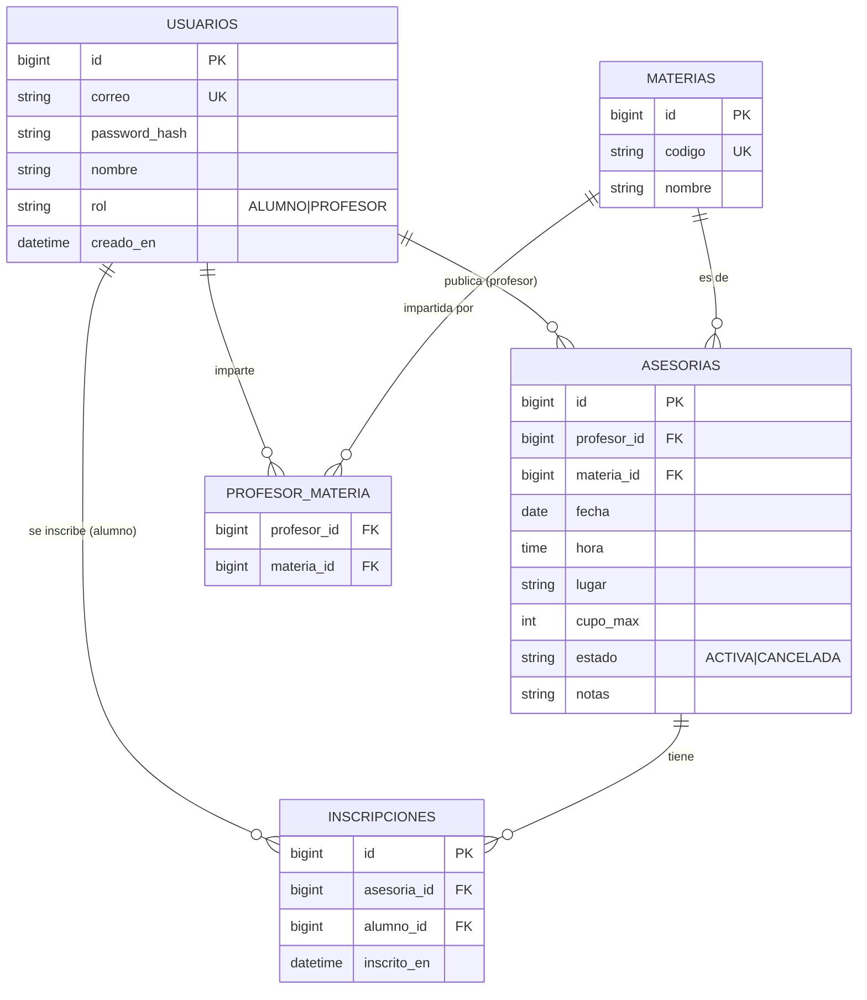

# Modelo Entidad-Relación

## Diagrama

## Reglas de negocio

1. Un profesor solo puede impartir materias que tenga asignadas en `profesor_matiera`.
2. Un alumno no puede inscribirse dos veces a la misma asesoría (`UNIQUE(asesoria_id, alumno_id)`).
3. No se aceptan inscripciones si `COUNT(inscripciones) >= cupo_max`.
4. Solo el profesor dueño puede modificar o cancelar su asesoría.
5. Una asesoría CANCELADA no admite nuevas inscripciones.
